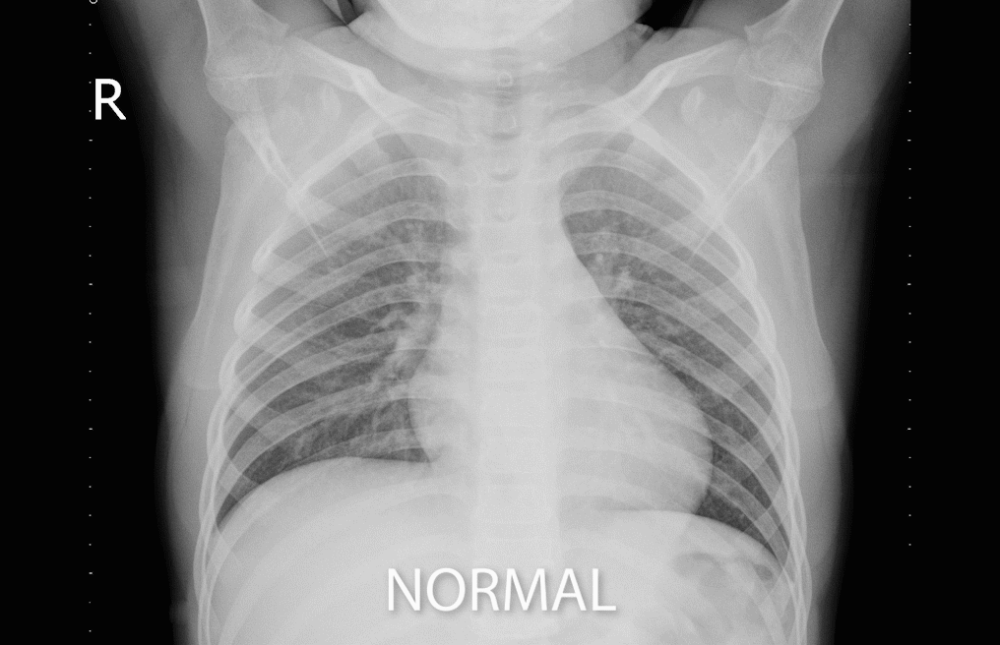
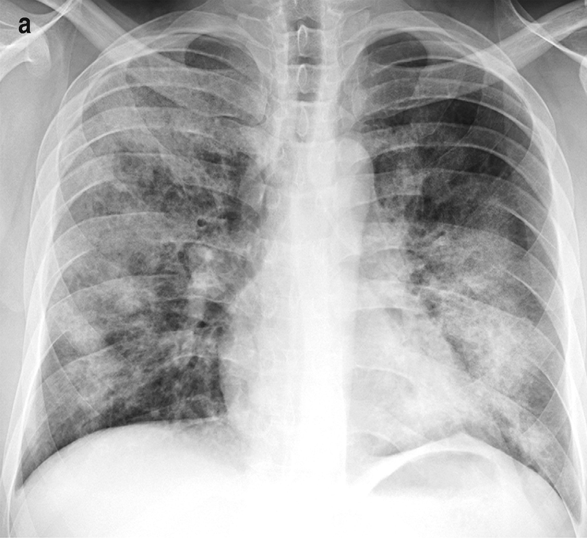
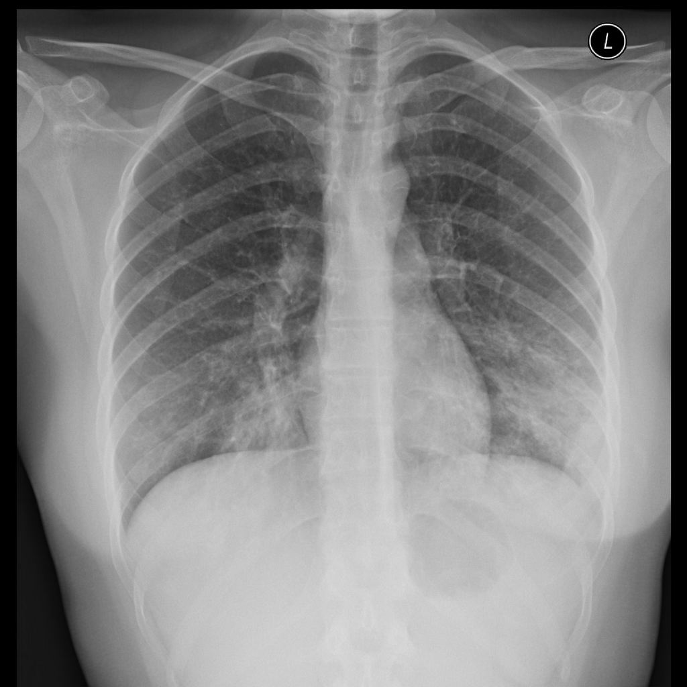
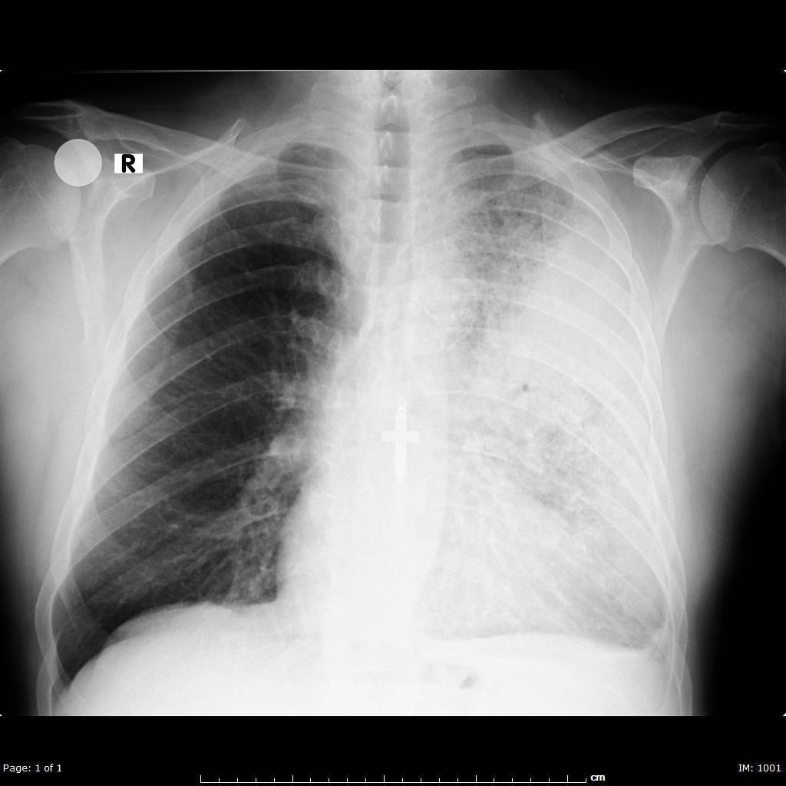

# Pneumonia Chest X Rays
## A Case Study Using Neural Networks to Identify Pneumonia in Chest X Rays
Author: [Edward De Jesus](https://github.com/edejesus196)

## Overview
Pneumonia is an infection in the Lungs caused by microbes. The most common causes are due to virus and bacteria that manage to evade the human body’s defense mechanisms and colonize the lungs' Bronchioles or Alveoli. This results in inflammation that causes the lungs to fill up with fluids, which makes it hard to breath. According to the Center for Desease Control (CDC), about 50,000 people die from pneumonia each year in the United States. The mortality rate for patients with severe cases of the pnemonia is up to 30%.

Pneumonia can be detected in x ray images of the lungs. There are three types of pneumonia: bronchopneumonia, atypical pneumonia and Lobar pnuemonia. Each type has discernible patterns that appear in x rays.

The image below shows a case of Bronchopneumonia, which shows up as patchy areas and spreads throughout the lungs.

Atypical pneumonia commonly  concentrates in the perihilar region of the lungs.

Lobar pneumonia is when fluid localizes to single lobe and show as a concentration in a region of the lungs.

In this case study, I test several convolutional neural networks to identify wether an X ray image is shows normal lungs or lungs infected with pneumonia.The dataset used in this case study comes from Kermany et al. on [Mendeley](https://data.mendeley.com/datasets/rscbjbr9sj/3), but this project uses the [Kaggles’ version](https://www.kaggle.com/paultimothymooney/chest-xray-pneumonia).

## Approach

### Data and model preparation in 5 major steps:

1. **Preprocessing -** Import and scale training, validation and testing batches of x ray images.
2. **Modeling -** Create several convolutional models with different hidden neurons and layers.
3. **Training -** Train the different models on the training batch.
4. **Evaluating -** Evaluate the model on the validation and test batches using the Adam optimizer, binary cross-entropy loss function, and the accuracy metric. I also evaluate the models using the F1 score and recall metric.
5. **Tunning -** Experiment with different numbers of hidden neurons and layers and compare results.

## Results
I tested three convolutional 3 neural networks on the validation and testing batches. Below are the results I obtained evaluation the models on the testing batch. Model 1 is a simpler model containing 32 hidden neurons in the first and second convolutional hidden layer, and 100 hidden neurons in a third dense layer. Model 2 contains 32 hidden neurons in the first and second convolutional hidden layers, and 100 hidden neurons in a third dense layer. And Model 3 has 64 hidden neurons in the first convolutional first hidden layer, but 32 in the send and a third hidden layer, and 100 hidden neurons in a fourth dense hidden layer.

|          |Test Loss|Test Accuracy|F1 Score|Recall|
|:---------|:--------|:------------|:-------|:-----|
|NN Model 1|0.586    |80%          |0.828   |99%   |
|NN Model 2|0.753    |79%          |0.832   |99%   |
|NN Model 3|0.513    |83%          |0.868   |97%   |

## Next Steps

## Repository Structure
    
    ├── images                            Images
    ├── presentation                      Final PowerPoint presentation slideshows
    ├── main_notebook.ipynb               Final notebook 
    ├── pneumoniaCDC2010.csv              CDC data used for timeseries chart of pnuemoia cases
    └── README.md                         ReadMe